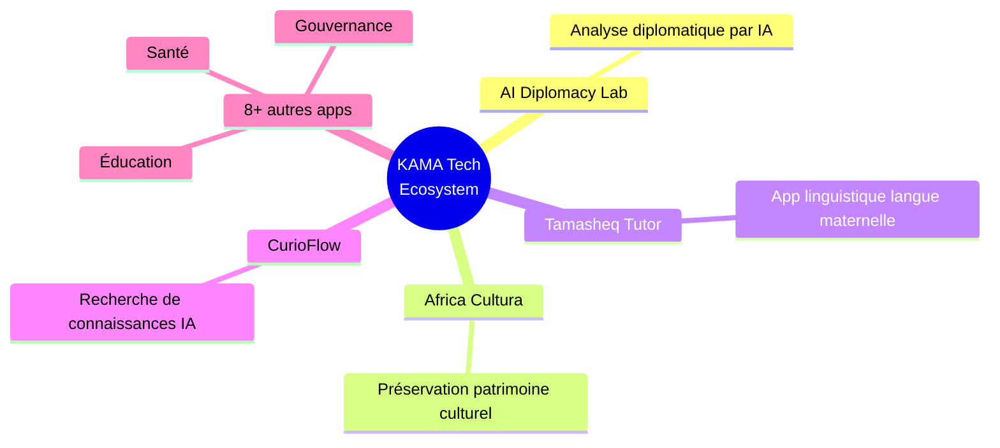
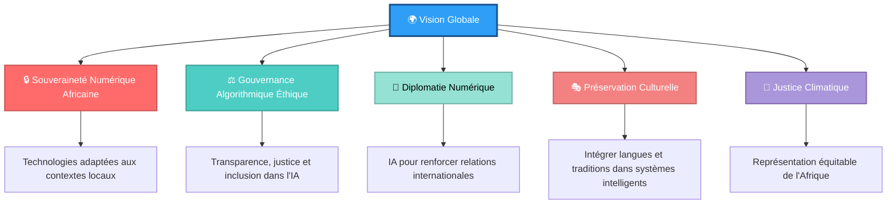

# 👋 Salut, je suis Khalid Ag Mohamed Aly

<div align="center">

[](https://git.io/typing-svg)

**🌍 Construire des ponts entre l'Intelligence Artificielle et la Gouvernance Humaine**

[](https://linkedin.com/in/khalid-ag-mohamed-aly)
[](https://github.com/khalidagmohamedaly)
[](mailto:alansarymohamed38@gmail.com)

</div>

---

## 🎯 À Propos de Moi

> **"L'Afrique ne doit pas subir la technologie — elle doit la façonner."**

Je suis un **chercheur interdisciplinaire** passionné par l'intersection entre **sciences politiques** et **intelligence artificielle**. Ma mission : façonner une gouvernance technologique **éthique, inclusive et afrocentrée**.

🎓 **Double Formation Unique**
- 📚 Licence en Sciences Politiques | Université Centrale de Tunis (2023-2026)
- 🤖 Licence en Intelligence Artificielle | African Development University, Niger (2022-2023)

📘 **Auteur** de *"L'Éthique de l'Intelligence Artificielle en 2025 : Défis et Perspectives"* (Éditions Universitaires Européennes)

🚀 **Fondateur** de KAMA Tech Hub & Karal Academy — Écosystème tech africain pour l'innovation éthique

---

## 💼 Expérience Professionnelle

### 🔬 **Stages Techniques (2025)**

| Période | Rôle | Organisation | Réalisations Clés |
|---------|------|--------------|-------------------|
| 🗓️ Oct 2025 | **Data Science & Analytics Intern** | Future Interns | ✅ Pipelines analytiques avancés<br>✅ Modèles prédictifs & visualisations interactives<br>✅ Certificat avec distinction |
| 🗓️ Août-Sept 2025 | **Cybersecurity Intern** | Future Interns | ✅ Moteur SIEM basé sur MITRE ATT&CK<br>✅ Analyse comportementale & dashboards temps réel<br>✅ ML pour surveillance de sécurité |
| 🗓️ Août-Sept 2025 | **Machine Learning Intern** | Future Interns | ✅ Pipelines NLP sophistiqués<br>✅ CNN avec 87% de précision<br>✅ 12 projets IA déployés |
| 🗓️ Juil-Août 2025 | **Prompt Engineering Intern** | Future Interns | ✅ Prompts avancés (GPT, Claude)<br>✅ Chatbots personnalisés<br>✅ Documentation technique complète |

---

## 🚀 Entrepreneuriat & Innovation

### **🏢 KAMA Tech Hub & Karal Academy** *(Fondateur, 2023-Présent)*

<div align="center">

| 📊 Métrique | 🎯 Impact |
|------------|----------|
| 👨‍🎓 **Jeunes Formés** | **200+** en IA éthique, cybersécurité, dev web |
| 💻 **Applications Développées** | **12+** solutions innovantes |
| 🌍 **Communauté Tech** | Active en Afrique de l'Ouest |

</div>

### 🎨 **Applications Phares Développées**



#### 🌟 **Projets Détaillés**

| 💡 Application | 📝 Description | 🛠️ Technologies |
|----------------|----------------|-----------------|
| **🤝 AI Diplomacy Lab** | Analyse diplomatique et géopolitique par intelligence artificielle | Python, NLP, TensorFlow |
| **🎭 Africa Cultura** | Préservation et valorisation du patrimoine culturel africain via IA | React, Firebase, ML |
| **📚 Tamasheq Tutor** | Plateforme d'apprentissage de la langue et culture Tamasheq | Next.js, AI API, Node.js |
| **🔍 CurioFlow** | Moteur de recherche intelligent pour l'exploration de connaissances | Python, OpenAI API, RAG |
| **🏥 HealthTech Solutions** | Applications santé pour l'Afrique | React Native, TensorFlow |
| **📖 EduTech Platform** | Plateforme éducative adaptée au contexte africain | Next.js, Firebase |

---

## 🌍 Engagement International & Leadership

### 🏆 **Programmes de Leadership**

<table>
<tr>
<td width="50%">

#### 🌱 **FXB Climate Advocates Fellow**
*FXB International | Automne 2025*

✅ Session active du 24 octobre 2025  
✅ Intervention sur défis climatiques en Afrique  
✅ Plaidoyer pour justice climatique  
✅ Finance climatique & adaptation  
✅ Réformes institutionnelles

</td>
<td width="50%">

#### 🎓 **Harvard Aspire Leaders Fellow**
*Harvard Aspire Institute | 2025*

✅ Leadership global & innovation sociale  
✅ Impact durable & transformation systémique  
✅ Réseau international de leaders émergents  
✅ Module 1 complété (15h)

</td>
</tr>
</table>

### 🌿 **Certifications en Gouvernance Environnementale**
- 🎓 **IDEP / UNICEF** — Politiques environnementales & développement durable
- 🌍 **UN CC:Learn** — Climate Change & Governance

---

## 📚 Publications & Recherche

### 📖 **"L'Éthique de l'Intelligence Artificielle en 2025 : Défis et Perspectives"**

**Éditions Universitaires Européennes**

<div align="center">

| 🎯 Thèmes Abordés |
|-------------------|
| 🔍 Analyse éthique de l'IA sous prisme africain, arabe et international |
| 🌐 Souveraineté numérique et gouvernance algorithmique |
| ⚖️ Justice, transparence et inclusion dans les systèmes intelligents |
| 🌍 Adaptation des technologies aux contextes locaux africains |

</div>

**🔑 Contribution Majeure** : Apporter une perspective africaine nécessaire dans un débat dominé par les voix occidentales.

---

## 💻 Stack Technique

### 🤖 **Intelligence Artificielle & Machine Learning**

```python
ai_skills = {
    "frameworks": ["TensorFlow", "PyTorch", "Scikit-learn"],
    "techniques": ["CNN", "RNN", "Transformers", "NLP", "Computer Vision"],
    "specializations": ["Deep Learning", "Éthique de l'IA", "Gouvernance algorithmique"],
    "precision_achieved": "87% (CNN models)"
}
```

<div align="center">


</div>

### 📊 **Data Science & Analytics**

```python
data_science_stack = {
    "languages": ["Python", "SQL", "NoSQL"],
    "libraries": ["Pandas", "NumPy", "Matplotlib", "Seaborn"],
    "visualization": ["Tableau", "Power BI", "Plotly"],
    "capabilities": ["Pipelines de données", "Modèles prédictifs", "Analytics avancées"]
}
```

<div align="center">


</div>

### 🔐 **Cybersécurité**

```bash
# Security Arsenal
SIEM_Tools = ["Splunk", "Kibana", "ELK Stack"]
Frameworks = ["MITRE ATT&CK"]
Capabilities = [
    "Analyse comportementale",
    "Détection de menaces",
    "Sécurité systèmes & réseaux",
    "Machine Learning pour cybersécurité"
]
```

<div align="center">


</div>

### 🌐 **Développement Web & Software**

<div align="center">

**Frontend**  


**Backend & Tools**  


</div>

### 🧠 **Prompt Engineering & IA Générative**

```javascript
const generativeAI = {
    models: ["GPT-4", "Claude", "Gemini"],
    skills: [
        "Conception de prompts avancés",
        "Développement de chatbots",
        "Fine-tuning de modèles",
        "RAG (Retrieval-Augmented Generation)"
    ],
    applications: ["Assistants IA", "Agents conversationnels", "Systèmes de recommandation"]
};
```

<div align="center">


</div>

---

## 🗣️ Langues

<div align="center">

| 🌐 Langue | 📊 Niveau | 🎯 Certification |
|-----------|----------|------------------|
| 🇫🇷 **Français** | C2 (Natif) | ✅ |
| 🇬🇧 **Anglais** | C1 | ✅ TOEFL Certifié |
| 🇪🇸 **Espagnol** | B2 | ✅ |
| 🏜️ **Tamasheq** | Langue Maternelle | 🏡 |

</div>

---

## 🏅 Certifications Majeures

### 📊 **97+ Certifications Professionnelles** (2023-2025)

<details>
<summary><b>🤖 Intelligence Artificielle & Data Science</b></summary>

- ✅ **DeepLearning.AI** — AI Specializations
- ✅ **Vanderbilt University** — AI & Machine Learning
- ✅ **Yonsei University** — Data Analytics
- ✅ **Stanford University** — Machine Learning
- ✅ **IBM** — AI Engineering Professional Certificate

</details>

<details>
<summary><b>🔐 Cybersécurité</b></summary>

- ✅ **ISC²** — Certified in Cybersecurity
- ✅ **Palo Alto Networks** — Cybersecurity Fundamentals
- ✅ **Infosec** — Security Awareness
- ✅ **Cisco** — Introduction to Cybersecurity
- ✅ **CompTIA** — Security+ Preparation

</details>

<details>
<summary><b>🌍 Sciences Politiques & Relations Internationales</b></summary>

- ✅ **Jindal Global Law School** — International Relations
- ✅ **Open University** — Political Science
- ✅ **UN CC:Learn** — Climate Change & Governance
- ✅ **IDEP / UNICEF** — Gouvernance Environnementale
- ✅ **Harvard University** — Global Leadership

</details>

<details>
<summary><b>🤝 Action Humanitaire</b></summary>

- ✅ **MSF** — Humanitarian Action
- ✅ **UNHCR** — Refugee Protection
- ✅ **UNICEF** — Child Rights & Development
- ✅ **ICRC** — International Humanitarian Law

</details>

<details>
<summary><b>💼 Management & Éthique</b></summary>

- ✅ **SOAS University of London** — Ethics in Technology
- ✅ **ESSEC Business School** — Management
- ✅ **Honoris United Universities** — Leadership
- ✅ **MIT** — Ethics and Governance of AI

</details>

---

## 📈 GitHub Stats

<div align="center">


</div>

### 📊 **Contributions en 2025**

```
  279 contributions dans l'année écoulée
  
  ████████████████████████░░░░░  Novembre - Présent
  ███████████████░░░░░░░░░░░░░  Octobre
  ██████████░░░░░░░░░░░░░░░░░░  Septembre
  █████░░░░░░░░░░░░░░░░░░░░░░░  Août
```

---

## 🎯 Vision & Axes de Travail

<div align="center">



</div>

### 🎯 **Principes Directeurs**

| 💡 Principe | 📝 Description |
|-------------|----------------|
| 🌍 **Afrocentrisme Technologique** | Développer des technologies pensées depuis et pour l'Afrique |
| ⚖️ **Éthique par Design** | Intégrer l'éthique dès la conception, pas après-coup |
| 🤝 **Inclusion Radicale** | Assurer que personne n'est laissé pour compte dans la révolution numérique |
| 🌱 **Durabilité Systémique** | Solutions technologiques alignées avec justice climatique |
| 🎓 **Éducation Accessible** | Démocratiser l'accès aux compétences tech de pointe |

---

## 🏆 Distinctions & Reconnaissance

<div align="center">

| 🎯 Distinction | 📊 Impact |
|----------------|----------|
| **🎓 Double Compétence Rare** | Sciences Politiques + IA Appliquée |
| **💼 Expérience Terrain Validée** | 5 stages techniques avec recommandations officielles |
| **🌍 Réseau International d'Excellence** | Harvard, FXB, UNICEF, ISC², DeepLearning.AI |
| **📈 Impact Local & Global Mesuré** | 200+ jeunes formés, 12+ apps IA, livre publié |
| **🌟 Vision Afrocentrée Authentique** | L'IA au service de l'Afrique, non l'inverse |

</div>

---

## 🤝 Ouvert à la Collaboration

Je recherche activement des collaborations sur :

<table>
<tr>
<td width="50%">

### 🌐 **Recherche & Politique**
- 🔬 AI & Policy Research
- 📊 Data Analytics pour institutions publiques
- 🌍 Gouvernance algorithmique en Afrique
- ⚖️ Éthique de l'IA et droits humains

</td>
<td width="50%">

### 💻 **Projets Tech**
- 🤖 Plateformes éducatives IA éthique
- 🌍 Applications d'impact social
- 🔐 Solutions cybersécurité pour l'Afrique
- 🎭 Préservation culturelle via technologie

</td>
</tr>
</table>

### 🎯 **Domaines d'Expertise pour Collaboration**

```
📌 Diplomatie Numérique & Gouvernance
📌 IA Éthique & Souveraineté Numérique Africaine
📌 Data Science pour le Bien Public
📌 Cybersécurité & Protection des Données
📌 Justice Climatique & Technologies Durables
📌 Éducation Tech & Capacity Building
```

---

## 📬 Contact & Réseaux

<div align="center">

### 💬 **Discutons Innovation, Éthique & Impact !**

[](mailto:alansarymohamed38@gmail.com)

[](https://linkedin.com/in/khalid-ag-mohamed-aly)

[](https://github.com/khalidagmohamedaly)

[](#)

</div>

---

## 💭 Citation Signature

<div align="center">

### ✨ **"Innovation with Conscience, Technology with Purpose"** ✨

---

> *"La technologie sans éthique est un danger.  
> La politique sans technologie est aveugle.  
> Ensemble, elles peuvent bâtir un avenir juste."*
> 
> **— Khalid Ag Mohamed Aly**

---


**🌍 Basé à Tunis, Tunisie | 🌐 Impact Global | 🇳🇪 Origines Niger**

[](https://github.com/khalidagmohamedaly)

**⭐ Si mon travail vous inspire, n'hésitez pas à star ⭐ mes repos !**

</div>
